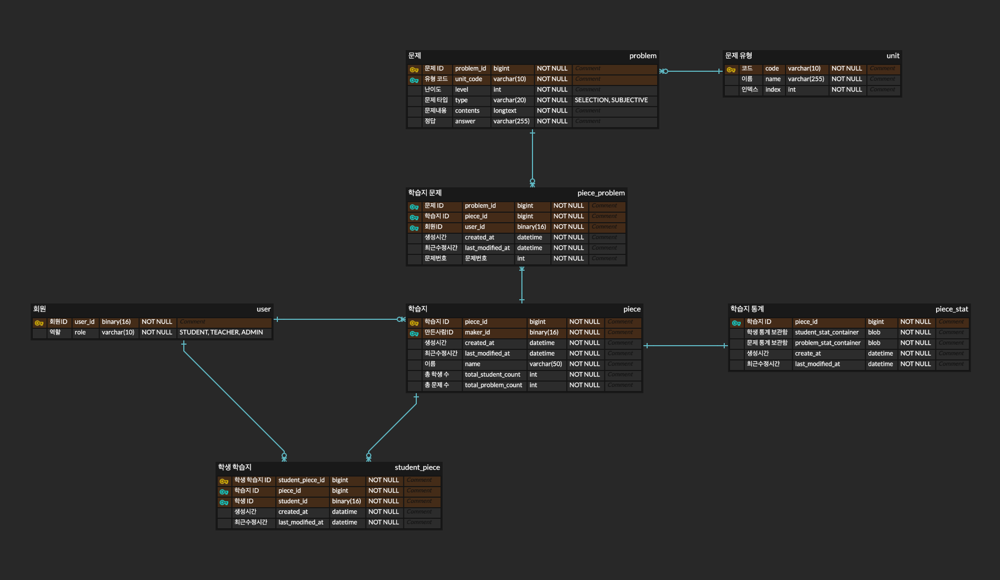

# 프리윌린 과제

## ERD



---

## API 문서

- REST Docs: 프로젝트 실행 후 [http://localhost:8080/docs/index.html](http://localhost:8080/docs/index.html)
- Postman: [https://documenter.getpostman.com/view/20867501/2sAYJ4gzJn](https://documenter.getpostman.com/view/20867501/2sAYJ4gzJn)

---

## 참고 사항

- gradle 멀티 모듈 프로젝트로 되어있습니다.
   - common: 범용적으로 사용되는 유틸성 기능들이나, 클래스들이 선언되어 있습니다.
   - piece-service: 이번 과제를 구현한 모듈 입니다.
- piece-service는 헥사고날 아키텍처로 구현되어 있습니다.

    ```text
    ├── adapter: 어댑터 계층
    │   ├── driven: 애플리케이션 코어의 요청을 외부 시스템(데이터베이스, API 등)에 전달
    │   │   ├── event: 애플리케이션 코어의 요청을 받아 이벤트를 발행하는 계층
    │   │   └── persistence: 애플리케이션 코어의 요청을 받아 데이터를 영속하는 계층
    │   └── driving: 사용자 요청이나 외부 이벤트를 애플리케이션 코어로 전달
    │       ├── event: 이벤트를 수신받아 애플리케이션 코어로 전달하는 계층
    │       └── web: 웹 요청을 애플리케이션 코어로 전달하는 계층
    ├── application: 애플리케이션 계층
    │   ├── dto
    │   ├── port
    │   │   ├── inbound: 외부 요청이 애플리케이션 코어로 진입할 수 있도록 정의된 인터페이스
    │   │   └── outbound: 애플리케이션 코어에서 외부 시스템과 상호작용하기 위해 정의된 인터페이스
    │   └── service: 비즈니스 로직 처리 계층
    ├── config: 애플리케이션 설정
    ├── domain: 도메인 계층
    │   ├── event: 도메인 이벤트
    │   ├── exception: 도메인 예외
    │   └── model: 도메인 모델
    └── supports: 애플리케이션에서 사용하는 유틸성 기능들
    ```

   - Spring Boot, Kotlin, JPA 를 기반으로 만들었습니다.
   - 개발 생산성을 고려해 도메인 모델과 엔티티 모델을 분리하지는 않았습니다. (`PieceStat` 제외)
      - 따라서 최대한 도메인 주도적인 코드를 작성하였으나, 엔티티 모델에 맞추기 위해 괴리적인 부분이 존재할 수도 있습니다.
- 복잡한 비즈니스 혹은 도메인 로직은 해당 문서에 구현 순서와 소스코드 내 주석으로 기술 해놓았습니다.

---

## 도메인 모델 설명

| 한글이름 | 영어이름 | 설명 |
| --- | --- | --- |
| 문제 | Problem | 문제를 의미합니다. |
| 유형코드 | UnitCode | 유형코드를 의미합니다. |
| 학습지 | Piece | 선생님이 만드는 학습지를 의미합니다. |
| 학생의 학습지 | StudentPiece | 학생이 받은 학습지를 의미합니다. |
| 학습지 문제 | PieceProblem | 학습지에 속한 문제를 의미합니다. |
| 학습지 통계 | PieceStat | 학습지에 대한 통계를 의미합니다. |

---

## 문제 1번 - 문제 조회

### 참고사항

- 문제를 정해진 비율로 나눌 수 없는 경우, 비율과 가장 근사한 값으로 문제를 할당합니다.
   - 예를 들어 `totalCount = 15`, `level = HIGH`일 때,
      - 상: 8개(53.3%), 중: 4(26.6%)개, 하 3(20%)개씩 조회됩니다.
- 특정 범위가 비율에 해당하는 문제 수를 채우지 못한 경우, 비율이 맞지 않더라도 나머지 범위에서 문제 수를 채워 무조건 totalCount 만큼 조회합니다.
   - 예를 들어, `totalCount = 15`, `level = HIGH`일 때,
      - 상: 8개(53.3%), 중: 4(26.6%)개, 하 3(20%)개씩 조회되어야 하지만,
      - 난이도 상에 해당하는 문제 수가 3개밖에 없는 경우,
      - 나머지 중, 하에 해당하는 문제에서 5개의 문제를 더 채우게 됩니다.
         - 즉 난이도 상을 제외한 나머지 12개의 문제를  `중:하 = 30:20` 의 비율로 채우게 됩니다.
- 문제가 totalCount 만큼 조회되지 않는 경우는, 요구사항에 명시된 대로 상, 중, 하 문제가 모두 부족한 경우에만 발생합니다.
- 문제 도메인의 숫자 난이도(1 ~ 5)를 앞으로 `level` 이라고 지칭하며, 숫자 난이도를 범위로 묶은 “상”, “중”, “하”를 앞으로 `LevelCategory(LOW, MIDDLE, HIGH)` 라고 지칭하겠습니다.

### 위험 요소 및 해결 방안

1. `level` 상관 없이 unitCodeList, problemType 으로 조건을 걸어 모든 문제를 메모리에 불러온 후, `LevelCategory` 별 문제 비율을 나누는 작업을 애플리케이션 단에서 하게 된다면, 문제의 개수가 많은 경우에 OOM 발생 가능성과 성능 저하 가능성이 있습니다.
- **해결 방안**: 난이도 별 가용 가능한 문제 “수”만 가져와 엔티티 전체를 메모리에 로드하지 않습니다.

2. 모든 문제를 조회하지 않고, `LevelCategory` 별 문제 비율에 따라 쿼리를 먼저 수행할 경우, 모자란 문제의 비율을 맞추기 위해 생각보다 많은 쿼리가 발생하여 DB와의 통신이 증가하고 응답성이 떨어질 수도 있습니다.
   - 예를 들어, 50% → 중 30% → 하 20% 순으로 비율을 맞춰 쿼리를 수행했는데, 하 난이도의 문제가 모자란 경우, 다시 상, 중 난이도의 문제를 쿼리해야 합니다.
- **해결 방안**: 각 난이도 범위 별 비율에 따라 조회해야 하는 엔티티 수를 애플리케이션 단에서 모두 계산한 후, 필요한 엔티티만 쿼리하여 해결합니다.

3. `LevelCategory` 에 속한 `level`과, `LevelCategory` 별로 조회되어야 하는 문제 비율이 변경될 가능성을 고려하여, 변경되더라도 조회 로직에는 영향이 없도록 해야합니다.
- **해결 방안**: `LevelCategory` 라는 Enum으로 `LevelCategory` 에 속한 `level`과, `LevelCategory` 별로 조회해야 되는 문제의 비율을 관리합니다.

### 구현 순서

1. `LevelCategory`별로 그룹지어, 미리 unitCode, problemType도 일치하는 가용 가능한 문제 수(`availableCount`)를 구합니다.
   - ex) `{ LOW = 5, MIDDLE = 11, HIGH = 2 }`
2. 총 가용 가능한 문제 수를 구해, totalCount와 비교하여, 도출해야 하는 남은 문제 수(`remainingCount`)를 초기화 합니다.
   - ex) `min(totalCount = 10, LOW + MIDDLE + HIGH = 18)` -> `remainingCount = 10`
3. 요구사항에 따른 `LevelCategory`별 비율을 구합니다.
   - ex) `HIGH -> { LOW=0.2, MIDDLE=0.3, HIGH=0.5 }`
4. `LevelCategory` 별 할당된 문제 수를 담는 Map을 만듭니다.
   - ex) `{ LOW = 0, MIDDLE = 0, HIGH = 0 }`
5. `remainingCount`가 0이 될 때까지 반복하여 난이도 별로 문제 수를 할당합니다.
   1. 전체 `LevelCategory`를 한번씩 루프 돌기 전, 데이터 초기화 작업을 합니다.
      1.  비율과 곱해져야 하는 기준이 되는 수(`baseCount`)를 초기화 합니다.
         1. `baseCount = remainingCount`
      2. `availableCount`가 없는 경우, 전체 비율에서 제외합니다.
         1. ex) 만약 `HIGH = 0` 이라면, 3번에서 구한 비율을 `{ LOW=0.4, MIDDLE=0.6 }` 으로 수정합니다.
   2. 전체 `LevelCategory`를 1번씩 루프 돌며 할당해야 할 수를 구합니다.
      1.  구한 `availableCount`를 찾습니다.
         - ex) `LOW = 5`
      2. `remainingCount`가 0이거나, `availableCount`가 0인 경우 문제를 할당할 수 없기에 반복을 즉시 종료하여 개선합니다.
         - ex) `remainingCount = 10`, `가용 가능한 문제 수 = 2` -> 종료하지 않음
      3. `baseCount`와, `LevelCategory`의 비율을 곱하여 할당 가능한 수(`allocableCount`)를 구합니다.
         - ex) `10 * 0.2(LOW) = 2`, 만약 1보다 작은 경우 1
      4. `allocableCount`와 `availableCount`, `remainingCount`중 작은 값을 할당된 수(`allocatedCount`)로 정합니다.
         - ex) `allocableCount(2)`,  `availableCount(5)`, `remainingCount(10)` → 2까지 할당 가능
      5. 4에서 만든 Map에 `allocatedCount`를 추가합니다.
         1. ex) `{ LOW = 2, MIDDLE = 0, HIGH = 0 }`
      6. `allocatedCount` 만큼 `remainingCount` 차감합니다.
         1. ex) `remainingCount(10)` - `allocatedCount(2)` = 10
      7. `allocatedCount` 만큼 `availableCount` 를 차감 합니다
         1. ex) `{ LOW = 5, MIDDLE = 11, HIGH = 2 }` → `{ LOW = 3, MIDDLE = 11, HIGH = 2 }`
      8. 다시 b 과정부터 반복합니다.
   3. 다시 a 과정부터 반복합니다.
6. 최종적으로 `LevelCategory` 별 할당된 문제 수를 가지고 쿼리합니다. (최소 0번, 최대 3번)
   - `{ LOW=3, MIDDLE=5, HIGH=2 }` -> `level` 1은 3개까지, `level` 2..4는 5개 까지, `level` 5..5는 2개까지

### **결과**

- 최소 1번, 최대 4번만 쿼리가 발생하게 되며, 메모리에 로드되는 엔티티의 수도 totalCount를 넘지 않습니다.
- 전체 `LevelCategory` 를 대상으로 반복한 후, 비율을 재조정하기 때문에 메인 루프(`while문`)의 최대 반복 수는 3입니다.

### **발생 가능한 문제**

- level로 그룹짓고 unitCode, problemType에 조건을 적용하여 쿼리하기 때문에 문제 수가 많은 경우 쿼리 소요 시간이 오래 걸릴 수 있습니다.
- **해결 방안**
   - level, unitCode, problemType를 포함하는 커버링 인덱스를 만들어서 속도를 개선합니다.
      - 문제 라는 데이터 특성 상, 위 3개의 값은 수정될 가능성이 낮기 때문에 데이터 수정 시 인덱스를 재정렬함에 따라 오는 오버헤드도 어느정도 감안할 수 있다고 생각합니다.
   - unitCode, problemType에 대해 level 별로 몇 건의 데이터가 있는 지 캐시합니다.
      - problemType은 특성 상 가능한 값이 많아질 수 없어 괜찮지만, unitCode는 가능한 값이 많아지는 경우 캐시 히트율이 떨어질 수도 있다고 생각합니다.
      - 캐시 레이어가 추가됨에 따라 DB 인덱스를 통해 개선하는 방식보다 인프라 비용이 증가할 수도 있습니다.

---

## 문제 2번 - 학습지 생성

이 요구사항은 단순히 학습지 생성 시점에만 문제를 추가하도록 되어있는데, 학습지 수정 시 문제가 추가될 수 있다는 점도 고려하여 구현하였습니다. 참고해주세요.

### 위험 요소 및 해결 방안

1. 문제를 여러 개 한번에 넣기 때문에, 문제 데이터를 조회할 때 여러번 쿼리가 나갈 수 있습니다.
- **해결 방안:** 문제 ID를 모두 넘겨 한번에 배치로 문제 데이터를 조회합니다.

1. JPA를 사용한 DDD를 구현하는 경우, 학습지의 최대 문제 수 50개를 검증하기 위해 학습지에 포함된 문제를 모두 조회하는 경우가 발생할 수도 있습니다.
- **해결 방안**
   - 문제수를 제한하는 것을 도메인 로직으로 보지 않고, 비즈니스 로직으로 봅니다.
      - 문제를 추가하기 전에 비즈니스 로직에서 문제 수만 쿼리하여 검증하도록 합니다.
         - 하지만 이 방식은 문제 추가를 처리하는 다른 비즈니스 로직에서도 언제나 공통적으로 관리되어야 하는 불편함이 있습니다.
         - 또한, 문제의 제한 수가 변경되는 경우, 이를 다루는 비즈니스 로직이 모두 변경되어야 합니다.
   - 학습지의 포함된 문제를 가지고 있는 `totalProblemCount` 라는 일종의 스냅샷을 만듭니다.
      - 6번 문제에서도, 전체 정답률을 계산하기 위해 학습지의 문제 수를 사용하기 때문에 적절하다고 생각하여 이 방식으로 구현하였습니다.

### 발생 가능한 문제

1. 하나의 학습지에 여러 회원이 문제 추가가 가능한 구조인 경우, 동시성 문제로 인해 `totalProblemCount`가 실제 학습지 문제 수와 달라질 수 있습니다.
- 해결 방안:
   1. `Piece`에 낙관적 락을 사용합니다.
      1. 낙관적 락에 의해 실패되는 트랜잭션에 대한 정책을 설정해야 합니다.
   2. `Piece`에 비관적 락을 사용합니다.
      1. `PESSIMISTIC_READ` 사용 시 데드락이 발생할 확률이 높으며, 데드락이 해제될 때 까지 응답이 지연될 가능성이 높습니다. 또한 타임아웃에 의해 실패한 트랜잭션에 대한 정책도 설정해야 합니다.
      2. `PESSIMISTIC_WRITE` 사용 시 데이터의 정합성은 보장되지만, 동시 처리성이 많이 떨어집니다.
   - 동시성 문제가 발생할 가능성이 낮은 경우라고 예상하기 때문에 **낙관적 락을 사용**할 가능성이 높을 거 같습니다.

---

## 문제 3번 - 학생에게 학습지 출제하기

### 위험 요소 및 해결 방안

1. 여러 학생에게 출제가 가능합니다.
   1. 외부에서 학생 정보를 가져올 때, 네트워크 통신이 많아질 수 있습니다.
- **해결 방안**: 단일, 병렬 조회 대신 일괄(배치)조회를 사용합니다.

1. 추후 학습지와 학생 정보를 엮어서 조회해야 할 일이 많이 생기는 경우, 조회 성능이 떨어질 수 있습니다.
- 해결 방안: 학습지 도메인에 필요한 학생 정보를 따로 학습지 서비스에 저장합니다.

---

## 문제 4번 - 학습지의 문제 조회하기

### 위험 요소 및 해결 방안

1. 학습지와 문제는 N:M 관계입니다.
   1. JPA를 사용하는 경우, N + 1 문제가 발생할 수 있습니다.
   2. 학습지 테이블, 연결 테이블(piece_problem), 문제 테이블 총 3번의 조인이 발생하여 쿼리 성능이 떨어질 수 있습니다.
- 해결 방안
   1. 페치 조인을 통해 학습지와 문제 엔티티를 한 번의 쿼리로 로드합니다.
   2. 조인이 많은 경우 쿼리를 분리하고, 적절한 배치 사이즈를 설정하여 N + 1 문제를 방지합니다.
- 1:N 관계를 여러 개 조인하는 것도 아니고, 조인의 수가 낮아 쿼리를 여러번 날리는 것보다 한번의 쿼리를 사용하는 것이 더 적절하다 판단하여 1번 방안으로 구현하였습니다.

1. 문제 풀이 화면에 필요한 데이터와, 학습지와 문제 테이블의 모든 컬럼 데이터가 많이 상이할 수도 있습니다.
   1. 조회 대상 컬럼의 차이가 많다면 메모리 비용과 조회 성능이 많이 차이날 수 있습니다.
- **해결 방안**: DTO 조회를 통해 필요한 컬럼만 조회하여 최적화합니다.

---

## 문제 5번 - 채점하기

### 위험 요소 및 해결 방안

1. 학습지와, 매핑 엔티티인 학생 학습지, 학습지 문제 간 복합 연산이 발생하는 경우 N + 1 문제가 발생하기 쉽습니다.
- **해결 방안**: 학습지를 채점하는 행위는 학생 학습지에서 이루어지는 것으로 판단하여, 학습지와 연관을 끊고 학생 학습지, 학습지 문제 간 연산으로 최적화 합니다.

### 구현 순서

1. 학생의 학습지(`StudentPiece`)를 조회합니다.
2. 채점해야 할 학습지 문제(`PieceProblem`)들을 조회합니다.
3. 제출한 답안을 `PieceProblem` 을 Key로 하여 매핑하여 Map을 만듭니다.
4. `StudentPiece` 에서 3번에서 만든 Map을 바탕으로 채점을 진행합니다.
   1.  `PieceProblem` 과 채점 결과(`GradeResult`)를 응답합니다.
5. `PieceProblem`의 `id`와 `GradeResult` 를 연관지어 반환합니다.

---

## 문제 6번 - 학습지 학습 통계 분석하기

### 위험 요소 및 해결 방안

1. 학습지, 학생 학습지, 학습지 문제 데이터를 모두 연관지어 통계해야 합니다.
   1. 통계해야 하는 데이터가 많고, 조회 시점에 통계를 분석한다면, 응답성이 많이 떨어질 수 있습니다.
- **해결 방안**: 통계 데이터에 대한 쿼리 모델을 따로 분리하여, 통계 분석 시점을 조회 시점이 아닌 관련 도메인의 생성 및 수정 시점에 하도록 변경합니다.
   - 조회 시점에 3개의 도메인을 분석하여 통계를 짓는 것이 아니라, 통계 도메인을 따로 쿼리 모델로 분리하여 미리 생성 및 수정해 놓습니다.
      - 일반적으로 쿼리성 요청이 커맨드성 요청보다 더 빈번하게 발생하기 때문에 효율적이라고 생각합니다.

1. 1번 방식을 동기적으로 구현할 경우, 통계 생성와 관련된 로직이 학습지 도메인의 로직에 영향을 줄 수 있습니다.
- **해결 방안**
   - 학습지와 관련된 트랜잭션을 학습지 통계와 묶지 않고 이벤트 기반의 비동기통신으로 처리합니다.
   - 학습지와 관련된 데이터가 변경되는 경우, 이를 감지해(CDC) 쿼리 모델에 반영합니다.

1. 1번 방식을 구현하는 경우, 학습지 통계 조회 모델을 학습지, 학생 학습지, 학습지 문제와 같은 연관 구조로 구현하는 경우, 결국 조회시점에 병목이 발생하는 건 마찬가지 입니다.
   1. 예를 들어, 학생에 대한 통계를 N으로 연관짓고, 학습지 문제를 N으로 연관짓는다면, 쿼리 관점에서 통계 도메인을 분리한 것에 이점을 얻지 못합니다.
- **해결 방안**: 학생 학습지와 학습지 문제 관련 통계는 JSON 타입으로 변환하여 바이너리 형식으로 저장합니다.

### 구현 방법

- 학습지 통계를 PieceStat 이라는 도메인으로 분리합니다.
- Piece가 생성될 때, 생성 이벤트를 발행하여 PieceStat을 생성합니다.
- Piece에 문제를 추가하여 PieceProblem이 생성될 때, 생성 이벤트를 발행하여 PieceProblemStat을 초기화 합니다.
- Piece를 제출하여 StudentPiece가 생성될 때, 생성 이벤트를 발행하여 StudentPieceStat을 초기화 합니다.
- StudentPiece 가 채점될 때, 채점 이벤트를 발행하여 PieceStat에 정답률 등의 통계 데이터를 계산하여 반영합니다.

### 발생한 문제

1. Hibernate6 JSON 타입 매핑 문제 (https://hibernate.atlassian.net/browse/HHH-17294)
   1. Embeddable 하지 않은 객체를 JSON 매핑에 사용하는 경우, 불변으로 판단해 변경감지가 이루어지지 않음
      - List<StudentPieceStat>, List<PieceProblemStat>이 변경되더라도, 엔티티는 더티하지 않다고 판단해버림.
   2. StudentPieceStat, PieceProblemStat은 내부에 Map 타입의 프로퍼티를 가지고 있어, 값 객체 내에서도 매핑이 되지 않아 Embeddable 사용 불가능

- 해결 방안
   1. JSON 데이터에 적합한, 스키마 제약이 없는 MongoDB와 같은 도큐먼트 DB 사용
      - 도큐먼트 DB를 이미 사용하고 있는 환경이거나, 도입할 만한 다른 사례가 있다면 고려 대상
   2. 도메인 모델과 엔티티 모델을 분리, 도메인 모델 내의 객체 프로퍼티는 ByteArray로 변환하여 엔티티에 매핑

### 발생 가능한 문제

1. 이벤트 처리가 실패한 경우, 학습지의 상태와 학습지 통계의 상태가 일치하지 않게 됩니다.

- 해결 방안
   - Retry, Fallback 매커니즘을 구현하여 실패한 이벤트에 대해 처리하는 로직을 구현합니다.
      - 최종 실패한 이벤트를 기록하고, 다시 처리하는 배치 모듈을 구현합니다.
      - 메시징 인프라를 구축하여 DLQ를 구현하고, DLQ에서 지속적으로 메시지를 폴링해 재처리하는 로직을 설계합니다.
      - 만약 통계가 무조건 생성되어야 하는, 즉 하나의 트랜잭션을 묶여야 하는 로직이라면 보상 트랜잭션을 통해 원본 도메인을 복구합니다.
   - 이벤트 처리에 실패한 통계에 대해 감지하는 로직을 구현하고, 해당 통계는 우선 학습지와 연관 도메인을 직접 쿼리하여 실시간 분석하는 방식으로 처리합니다.

1. 동시에 동일한 이벤트가 여러개 발행되는 경우, 동시성 문제가 발생할 수도 있습니다.
   - 예를 들어, 여러 명의 학생이 동시에 채점을 시도하게 된다면, 이벤트도 동시에 발행되어 처리되기 때문에 통계 모델이 실제 학습지 도메인 모델의 상태랑 다를 수가 있습니다.
- 해결 방안
   - 2번 문제에서 해결했던 방식 처럼, 비관적 락을 사용하여 동시성 문제를 제어할 수 있습니다.
   - 만약 Kafka를 사용하는 경우, `pieceId` 를 파티셔닝 키로 활용해 동일한 학습지에 대한 이벤트를 순차적으로 처리할 수 있게끔 개선할 수도 있습니다.

1. 하나의 도메인 이벤트에 영향을 받는 다른 도메인이 많아지는 경우, 비즈니스의 흐름을 관리하기 힘들어질 수있습니다.
- 해결 방안
   - Orchestration Saga 패턴을 구현하여 이벤트 기반 통신을 수행하는 분산 환경에서 트랜잭션을 제어합니다.